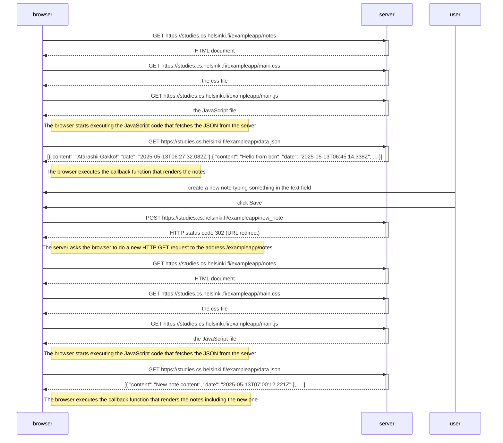

```mermaid
sequenceDiagram
    participant browser
    participant server
    participant user
   
    browser->>server: GET https://studies.cs.helsinki.fi/exampleapp/notes
    activate server
    server-->>browser: HTML document
    deactivate server

    browser->>server: GET https://studies.cs.helsinki.fi/exampleapp/main.css
    activate server
    server-->>browser: the css file
    deactivate server

    browser->>server: GET https://studies.cs.helsinki.fi/exampleapp/main.js
    activate server
    server-->>browser: the JavaScript file
    deactivate server

    Note right of browser: The browser starts executing the JavaScript code that fetches the JSON from the server

    browser->>server: GET https://studies.cs.helsinki.fi/exampleapp/data.json
    activate server
    server-->>browser:[{"content": "Atarashii Gakko!","date": "2025-05-13T06:27:32.082Z"},{ "content": "Hello from bcn", "date": "2025-05-13T06:45:14.338Z", ... }]
    deactivate server

    Note right of browser: The browser executes the callback function that renders the notes
    
    user->>browser: create a new note typing something in the text field
    user->>browser: click Save
    browser->>server: POST https://studies.cs.helsinki.fi/exampleapp/new_note
    activate server
    server-->>browser: HTTP status code 302 (URL redirect)
    deactivate server
    
    Note right of browser: The server asks the browser to do a new HTTP GET request to the address /exampleapp/notes
    
    browser->>server: GET https://studies.cs.helsinki.fi/exampleapp/notes
    activate server
    server-->>browser: HTML document
    deactivate server
    
    browser->>server: GET https://studies.cs.helsinki.fi/exampleapp/main.css
    activate server
    server-->>browser: the css file
    deactivate server
    
    browser->>server: GET https://studies.cs.helsinki.fi/exampleapp/main.js
    activate server
    server-->>browser: the JavaScript file
    deactivate server
    
    Note right of browser: The browser starts executing the JavaScript code that fetches the JSON from the server
    
    browser->>server: GET https://studies.cs.helsinki.fi/exampleapp/data.json
    activate server
    server-->>browser: [{ "content": "New note content", "date": "2025-05-13T07:00:12.221Z" }, ... ]
    deactivate server
    
    Note right of browser: The browser executes the callback function that renders the notes including the new one
```