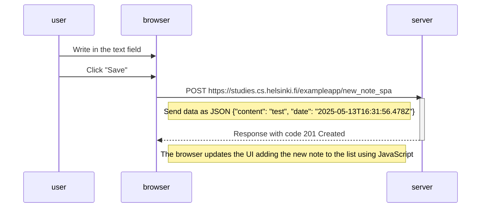

```mermaid
sequenceDiagram 
    participant user 
    participant browser 
    participant server
    
    user->>browser: Write in the text field
    user->>browser: Click "Save"
        
    browser->>server: POST https://studies.cs.helsinki.fi/exampleapp/new_note_spa
    activate server
    Note right of browser: Send data as JSON {"content": "test", "date": "2025-05-13T16:31:56.478Z"}
    server-->>browser: Response with code 201 Created
    deactivate server
    Note right of browser: The browser updates the UI adding the new note to the list using JavaScript
```